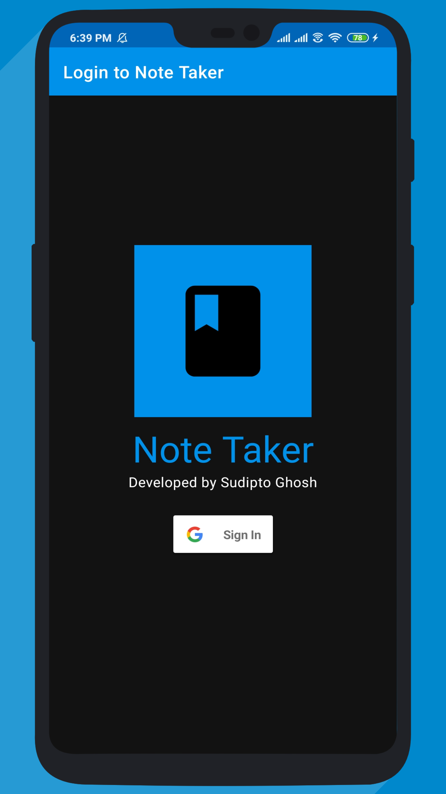
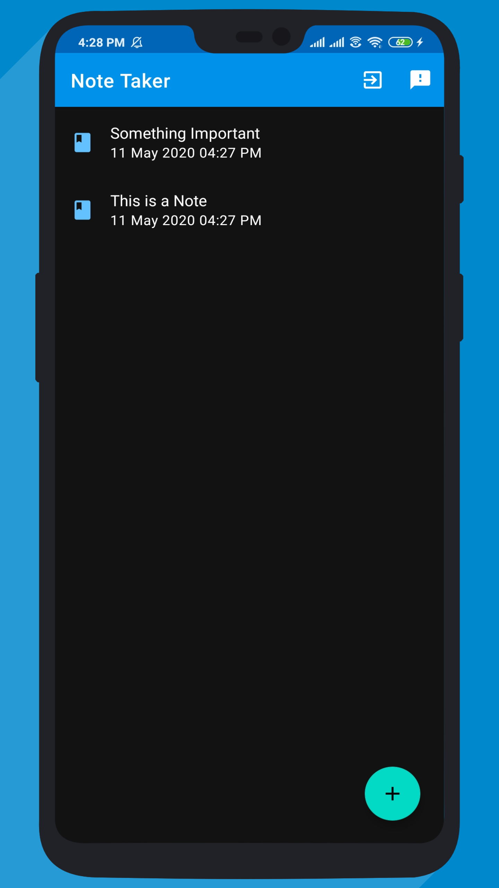
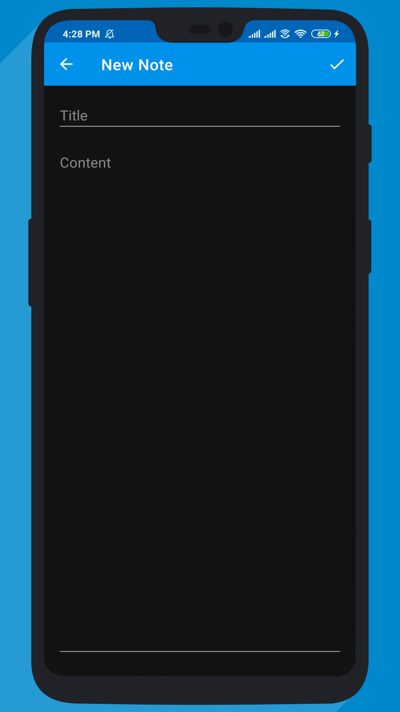
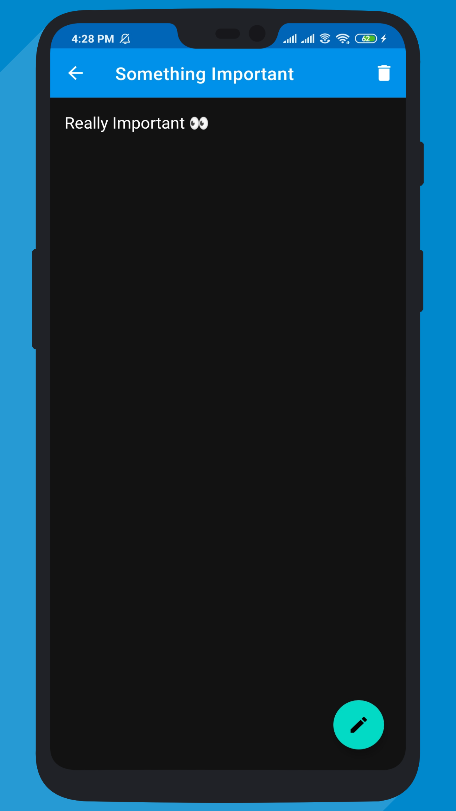

# 

This is a simple Android application that enables the user to add, edit and
delete notes and uses Google Firebase Authentication and Cloud Firestore to
perform CRUD operations.

**Minimum API Level**: 28 (Android Pie)
**Android Studio Version**: 3.6.3

## Screenshots

## License

Source Code distributed under the MIT Open-Source License.

## Author

[Sudipto Ghosh](https://sudipto.ghosh.pro/) sudipto[at]ghosh[dot]pro
